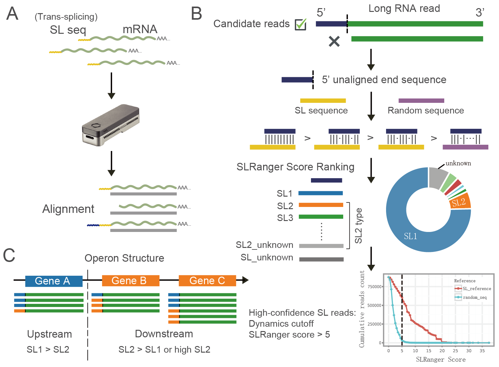

# SLRanger
Detection tool for operon and spliced leader designed for direct RNA sequencing 

## Workflow

<div align="center">
  
</div>

## Installation
###  a. Conda method
1. Prepare a new conda env
```
 conda create -n SLRanger_env python=3.9
 conda activate SLRanger_env
 conda install -c bioconda bedtools minimap2 samtools
 git clone https://github.com/lrslab/SLRanger.git
 cd SLRanger/
 pip install -r requirments.txt
```
2. Install from **Pypi** or clone from **github**
```
 pip install SLRanger
 # or
 git clone https://github.com/lrslab/SLRanger.git
```

###  b. Docker method
```
docker pull zhihaguo/slranger_env
```
##  Quick start

```
 cd sample/
 python SL_detect.py --ref SL_list_cel.fa --bam test.bam -o SLRanger.txt -t 4 --visualization
```